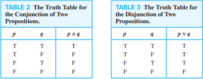
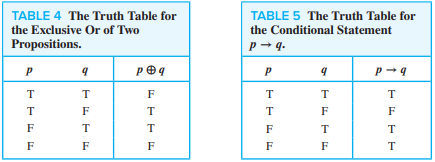
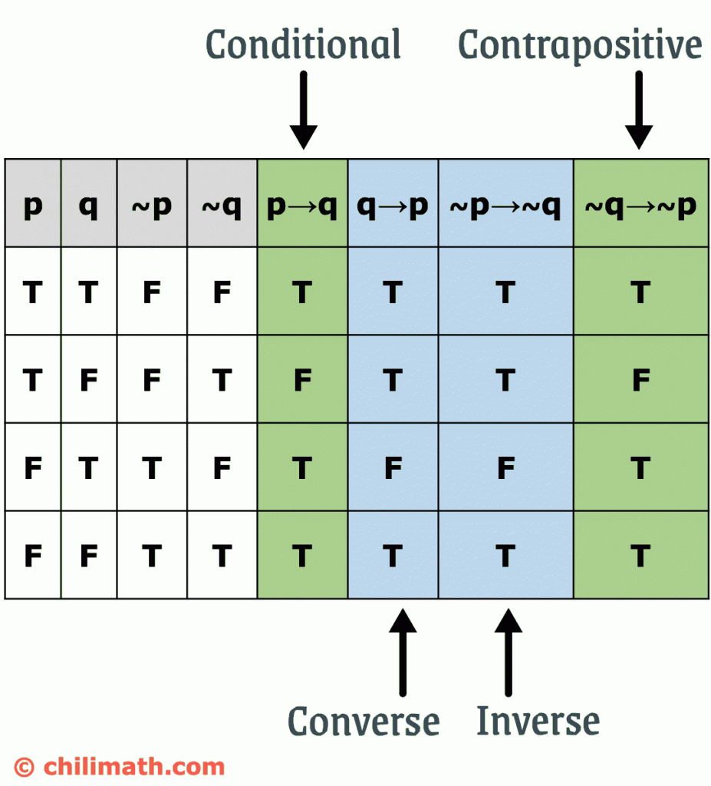
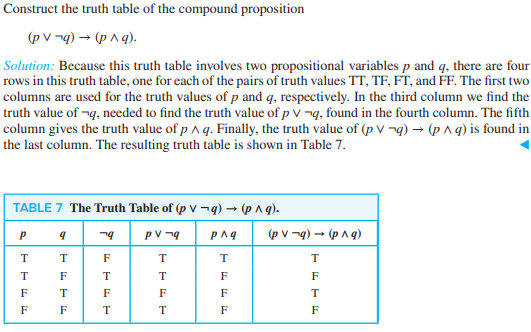
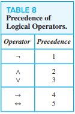
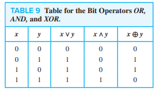
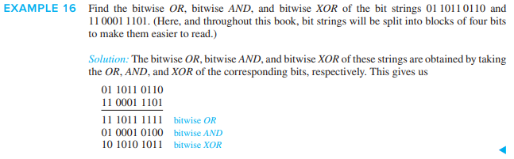

# Propositional Logic

The rules of logic give precise meaning to mathematical statements, distinguishing between valid and invalid mathematical arguments. The rules of logic are used in the construction and verification of correct computer programs.

## Propositions

Propositions are the basic building blocks of logic.

`proposition` - a declarative sentence that is either true or false, but not both

- a `declarative` sentence declares a fact

Examples: "Washington, D.C. is the capital of the USA" and "2 + 2 = 3"

Examples of non-propositions: "What time is it?" and "Read this carefully."

New propositions, called `compound propositions`, are formed from existing propositions using `logical operators`.

### Truth Tables

 

A truth table lists every possible input combination to a system, along with the outputs. `Table 2` has a row for each of the possible combinations of truth values of $p$ and $q$. Each row shows the truth value of $p \land q$ given the truth values of $p$ and $q$ for that row.

## Conditional Statements

A `conditional statement` like $p \Rightarrow q$ asserts that if $p$ is true, then $q$ MUST be true as well. We say that "$p$ implies $q$".

We know $p \Rightarrow q$ is false in the scenario where $p` is true but `q$ is false. In this scenario, we say that "$p$ does not imply $q$".

### Example: Politician Pete's Promise

> Politician Pete promises, "If I am elected, then I will lower taxes."

- $p$: "Pete is elected"
- $q$: "Pete will lower taxes"
- $p \Rightarrow q$: "If Pete is elected, then Pete will lower taxes"

We say that $p \Rightarrow q$ does not hold when Pete breaks his promise. Consider the following scenarios:

- "Pete is not elected; taxes are lowered"
    - Promise kept
    - Here, Pete does not have the chance to keep his promise, but taxes happen to get lowered anyways
- "Pete is not elected; taxes are not lowered"
    - Promise kept
    - Why? Because Pete only promised to lower taxes if he got elected!

Notice how in these two scenarios, we don't expect anything from Pete if he doesn't get elected. However, what if he actually does get elected?

- "Pete is elected; taxes are lowered"
    - Promise kept
    - Pete actually follows through on his promise!
- "Pete is elected; taxes are not lowered"
    - Promise broken!
    - This is the only scenario where we can conclusively say that Pete is a dirty liar

### Inverse, Converse, and Contrapositive

We can form some new conditional statements starting from $p \Rightarrow q$.

- `inverse` - $\neg p \Rightarrow \neg q$
- `converse` - $q \Rightarrow p$
- `contrapositive` - $\neg q \Rightarrow \neg p$

The contrapositive always has the same truth value as $p \Rightarrow q$. Why? Because the contrapositive is false only when $\neg q$ is true but $\neg p$ is false.

- In other words, the contrapositive is false only when $q$ is false but $p$ is true ("Pete was elected, but taxes were not lowered").
- When two compound propositions always have the same truth values, we call them `equivalent`

The inverse and the converse, on the other hand, never have the same truth value as $p \Rightarrow q$. This means they are only true when $p$ is true but $q$ is false ("Pete was elected, but taxes were not lowered").

#### Inverse, Converse, and Contrapositive Example

> "The home team wins whenever it is raining"

- $p$: "It is raining"
- $q$: "The home team wins"
- $p \Rightarrow q$: "If it is raining, then the home team wins"
- $\neg  p \Rightarrow \neg q$: "If it is not raining, then the home team will not win"
- $q \Rightarrow p$: "If the home team wins, then it is raining"
- $\neg q \Rightarrow \neg p$: "If the home team does not win, then it is not raining"

### Biconditionals

The `biconditional statement`, $p \iff q$, asserts that $p$ and $q$ have the same truth values. We say that "p holds if and only if q holds".

$p \iff q$ has the same truth value as $(p \Rightarrow q) \land (q \Rightarrow p)$

> "You can take the flight iff you buy a ticket"

This statement is true when we don't take the flight and don't buy a ticket. This statement is still true when we take the flight and we buy a ticket. However, this statement is false when we take the flight but don't buy a ticket (if the trip is free). This statement is also false when we don't take the flight but buy a ticket (if the airline bumps you)

## Truth Tables of Compound Propositions

## Precedence of Logical Operators

## Logic and Bit Operators

Computers represent information using bits. A `bit` is a symbol with two possible values, 0 and 1. A bit can be used to represent a truth value. A `Boolean variable` contains a value of either true or false. Computer `bit operations` correspond to logical connectives (OR, AND, XOR).

Information is often represented in `bit strings`, which are sequences of zero or more bits.

- `101010011` is a bit string of length 9

We can extend bit operations to bit strings:

# Exercises

`Fuzzy logic` is used in artificial intelligence. In fuzzy logic, a
proposition has a truth value that is a number between 0 and
1, inclusive. A proposition with a truth value of 0 is false and
one with a truth value of 1 is true. Truth values that are between 0 and 1 indicate varying degrees of truth. For instance,
the truth value 0.8 can be assigned to the statement “Fred is
happy,” because Fred is happy most of the time, and the truth
value 0.4 can be assigned to the statement “John is happy,”
because John is happy slightly less than half the time.

The truth value of the negation of a proposition in fuzzy
logic is 1 minus the truth value of the proposition. What
are the truth values of the statements “Fred is not happy”
and “John is not happy”?

- truth_value("Fred is not happy") = 1 - truth_value("Fred is happy") = 1 - 0.8 = 0.2
- truth_value("John is not happy") = 1 - truth_value("Hohn is happy") = 1 - 0.4 - 0.6

The truth value of the disjunction of two propositions in
fuzzy logic is the maximum of the truth values of the two
propositions. What are the truth values of the statements
“Fred is happy, or John is happy” and “Fred is not happy,
or John is not happy”?

- truth_value(“Fred is happy, or John is happy”) = max(0.8, 0.4) = 0.8
- truth_value(“Fred is not happy, or John is not happy”) = max(0.2, 0.6) = 0.6

---

Is the assertion "This statement is false" a proposition?

[StackExchange says no because the assertion is paradoxical](https://math.stackexchange.com/questions/697444/propositional-logic-dont-know-the-answer#:~:text=Statements%20such%20as%20%22this%20statement,Hence%20these%20are%20not%20propositions.)

[Introduction to mathematical paradoxes](https://brilliant.org/wiki/introduction-to-paradoxes/)

---

The nth statement in a list of 100 statements is "Exactly n of the statements in this list are false"

What conclusions can you draw from these statements?

- The 99th statement is true and the rest are false.

What conclusions can you draw if the nth statement is instead "At least n of the statements in this list are false"

- Statements 1 through 50 are all true and statements 51 through 100 are all false.

What conclusions can you draw if the nth statement is instead "At least n of the statements in this list are false" and the list contains 99 statements?

- This is a paradox, so these are not statements

[StackExchange explains](https://math.stackexchange.com/questions/2661333/the-nth-statement-in-a-list-of-100-statements-is-exactly-n-of-the-stateme)

---

The barber is the "one who shaves all those, and those only, who do not shave themselves". The question is, does the barber shave himself?

[Barber paradox](https://en.wikipedia.org/wiki/Barber_paradox)

Any answer to this question results in a contradiction: The barber cannot shave himself, as he only shaves those who do not shave themselves. Thus, if he shaves himself he ceases to be the barber specified. Conversely, if the barber does not shave himself, then he fits into the group of people who would be shaved by the specified barber, and thus, as that barber, he must shave himself.

In its original form, this paradox has no solution, as no such barber can exist. The question is a loaded question in that it assumes the existence of a barber who could not exist, which is a vacuous proposition, and hence false. There are other non-paradoxical variations, but those are different.
