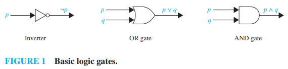
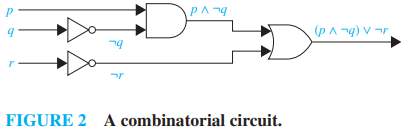
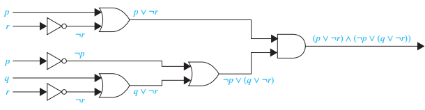

# Applications of Propositional Logic

Statements in mathematics, the sciences, and natural language are often imprecise or ambiguous. To make these statements precise, they can be translated into the language of logic.

For example:

- logic is used in the specification of software and hardware.
- propositional logic and its rules can be used to design computer circuits, construct computer programs, verify the correctness of programs, and build expert systems
- logic can be used to analyze and solve puzzles
- software systems based on the rules of logic have been developed for constructing some types of proofs automatically

## Translating English Sentences

Human languages are often ambiguous. Translating sentences into compound statements (and other types of logical expressions) removes the ambiguity.

Let's translate the following sentences into a logical expression:

---

> You can access the Internet from campus only if you are a computer science major or you are not a freshman

- $a$ - "You can access the Internet from campus"
- $c$ - "You are a computer science major"
- $f$ - "You are a freshman"
- $a \Rightarrow (c \vee \neg f)$

---

> You cannot ride the roller coaster if you are under 4 feet tall unless you are older than 16 years old

- $q$ - "You can ride the roller coaster"
- $r$ - "You are under 4 feet tall"
- $s$ - "You are older than 16 years old"
- $(r \wedge \neg s) \Rightarrow \neg q$

## System Specifications

Translating natural language sentences into logical expressions is an essential part of specifying both hardware and software systems.

---

Let's see how compound propositions can be used in this process. Express the following specification using logical connectives:

> The automated reply cannot be sent when the file system is full

- $p$ - "The automated reply can be sent"
- $q$ - "The file system is full"

Finally,

- $q \Rightarrow \neg p$ - "The automated reply cannot be sent when the file system is full"

---

System specifications should be `consistent`. Consistency means there are no conflicting requirements that could be used to derive a contradiction.

---

Determine whether these systems specifications are consistent:

> The diagnostic message is stored in the buffer or it is retransmitted

> The diagnostic message is not stored in the buffer

> If the diagnostic message is stored in the buffer, then it is retransmitted

- $p$ - "The diagnostic message is stored in the buffer"
- $q$ - "The diagnostic message is retransmitted"

The specifications can then be written as:

- $p \vee q$
- $\neg p$
- $p \Rightarrow q$

We need to find an assignment of truth values that makes all three specifications true.

- To make the specification $\neg p$ true, $p$ must be false.
- To make the specification of $p \vee q$ true while $p$ is false, then $q$ must be true.
- $p \Rightarrow q$ is true when $p$ is false and $q$ is true

We conclude that these specifications are consistent, because they are all true when $p = F$ and $q = T$.

- We could come to the same conclusion by examining a truth table

Now consider, do the system specifications remain consistent if the following specification is added?

> The diagnostic message is not retransmitted

- $\neg q$

By the reasoning previously, the other three specifications are true only when $p = F$ and $q = T$. However, $\neg q = F$ when $q = T$. Therefore, the specifications become inconsistent.

## Boolean Searches

A `Boolean search` employs techniques from propositional logic, using logical connectives such as AND, OR, NOT. Most web search engines support Boolean search.

Example on [Google Search](https://www.google.com/search?q=mexico+universities+-new): Finding universities in Mexico, while eliminating search results about New Mexico

> mexico universities -new

## Logic Puzzles

`Logic puzzles` can be solved using logical reasoning.

---

> As a reward for saving his daughter from pirates, the King has given you the opportunity to win a treasure hidden inside one of three trunks. The two trunks that do not hold the treasure are empty. To win, you must select the correct trunk. Trunks 1 and 2 are each inscribed with the
message “This trunk is empty,” and Trunk 3 is inscribed with the message “The treasure is in Trunk 2.” The Queen, who never lies, tells you that only one of these inscriptions is true, while the other two are wrong. Which trunk should you select to win?

Let $p_i$ be the proposition that the treasure is in Trunk $i$, for $i = 1, 2, 3$. To translate the Queen's statement into propositional logic (that exactly one of the inscriptions is true), we observe that the inscriptions on Trunk 1, Trunk 2, and Trunk 3, are $\neg p1, \neg p2, p2$, respectively. So, her statement can be translated to

> $(\neg p_1 \wedge \neg (\neg p_2) \wedge \neg p_2) \vee (\neg (\neg p_1) \wedge \neg p_2 \wedge \neg p_2) \vee (\neg (\neg p_1) \wedge \neg (\neg p_2) \wedge p_2) = T$

- $(\neg p_1 \wedge p_2 \wedge \neg p_2) \vee (p_1 \wedge \neg p_2) \vee (p_1 \wedge p_2) = T$
    - The first term $(\neg p_1 \wedge p_2 \wedge \neg p_2)$ evalutes to false
- $(p_1 \wedge \neg p_2) \vee (p_1 \wedge p_2) = T$
    - Use the distributive law...
- $p_1 \wedge (\neg p_2 \vee p_2) = T$
    - $p_1 \wedge T = T$
- $p_1 = T$

---

Raymond Smuyllan, a master of logic puzzles, posed many puzzles about an island that has two kinds of inhabitants. There are knights, who always tell the truth, and knaves, who always lie. You encounter two people $A$ and $B$. What kind of people are $A$ and $B$ if $A$ says "$B$ is a knight" and $B$ says "The two of us are opposite types"?

- $p$ - $A$ is a knight
- $q$ - $B$ is a knight

Consider the possibility that $A$ is a knight ($p = T$):

- If $A$ is a knight, then he is telling the truth when he says that $B$ is a knight.
- However, that would mean that $B$'s statement is a lie, which would mean $B$ is not a knight.
- This is a contradiction. Therefore, $A$ is a knave - $p = F$.

If $A$ is a knave, then $A$ is lying about $B$ being a knight. Therefore $B$ must be a knave:

- If $B$ is a knave, then $B$ is lying about $A$ and $B$ being opposite types.
- This is consistent with $A$ and $B$ both being knaves.
- We conclude that both $A$ and $B$ are knaves.

---

> A father tells his two children, a boy and a girl, to play in their backyard without getting dirty. However, while playing, both children get mud on their foreheads. When the children stop playing, the father says “At least one of you has a muddy forehead,” and then asks the children to answer “Yes” or “No” to the question: “Do you know whether you have a muddy forehead?” The father asks this question twice. What will the children answer each time this question is asked, assuming that a child can see whether his or her sibling has a muddy forehead, but cannot see his or her own forehead? Assume that both children are honest and that the children answer each question simultaneously.

- $s$ - the son has a muddy forehead
- $d$ - the daughter has a muddy forehead
- The father states $s \vee d = T$
- Both children will answer "no" the first time a question is asked because each sees mud on the other child's forehead.
    - the son knows $d = T$ but not what $s$ is
    - the daughter knows $s = T$ but not what $d$ is
- After the son has answered "no" to the first question, the daughter can determine that $d$ must be true. If $d$ was false, the son would have answered "yes" because $s \vee F = T$.
    - The son can reason in a similar way to determine that $s$ must be true
- Therefore, both children answer "yes" the second time the question is asked

## Logic Circuits

Propositional logic can be applied to computer hardware design. A `logic circuit` (or digital circuit) receives input signals $p_1, p_2, ..., p_n$, each a bit, and produces output signals $s_1, s_2, ..., s_n$, each also a bit.

Complicated digital circuits can be constructed from three basic circuits called `gates`. The gates take bit-sized inputs and produces an output bit.

- `NOT gate` (inverter)
    - input: $p$
    - output: $\neg p$
- `OR gate`
    - inputs: $p, q$
    - output: $p \vee q$
- `AND gate`
    - inputs: $p, q$
    - output: $p \wedge q$

---

Notice the output of this combinatorial circuit is:

- $(p \wedge \neg q) \vee \neg r$

Now build a digital circuit that produces the output:

> $(p \vee \neg r) \wedge (\neg p \vee (q \vee \neg r))$

# Exercises

Each inhabitant of a remote village always tells the truth
or always lies. A villager will give only a “Yes” or a “No”
response to a question a tourist asks. Suppose you are a
tourist visiting this area and come to a fork in the road.
One branch leads to the ruins you want to visit; the other
branch leads deep into the jungle. A villager is standing
at the fork in the road. What one question can you ask the
villager to determine which branch to take?

"If I were to ask you whether the right branch leads to the ruins, would you answer yes?"

[GateOverflow explanation](https://gateoverflow.in/42944/kenneth-rosen-edition-6th-exercise-1-2-question-15-page-no-23)
