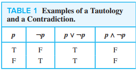
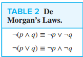
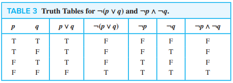
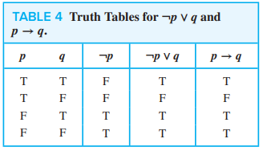
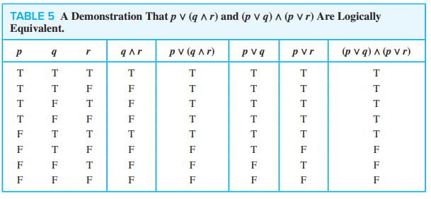
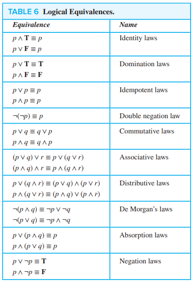
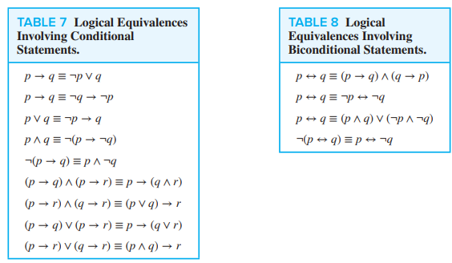

# Propositional Equivalences

An important type of step used in mathematical arguments is the replacement of a statement with another statement with the same truth value.

A `tautology` is a compound proposition that is always true

A `contradiction` is a compound proposition that is always false

A `contingency` is a compound proposition that is neither a tautology nor a contradiction

## Logical Equivalences

`Logically equivalent` compound propositions have the same truth values in all possible cases

- The compound propositions $p$ and $q$ are logically equivalent if $p \iff q$ is a tautology
- $p \equiv q$ denotes that $p$ and $q$ are logically equivalent
    - also $p \Leftrightarrow q$

We can use truth tables to show logical equivalence between two compound propositions.

Note that $\bigvee_{j=1}^{n} p_j = p_1 \vee p_2 \vee ... \vee p_n$

So De Morgan's Laws can also be written as:

- $\neg (\bigvee_{j=1}^{n} p_j \equiv \bigwedge_{j=1}^{n} \neg p_j)$
- $\neg (\bigwedge_{j=1}^{n} p_j) \equiv \bigvee_{j=1}^{n} \neg p_j$

---

Show that $\neg(p \vee q)$ and $\neg p \wedge \neg q$ are logically equivalent.

Because the truth values of the two compound propositions agree, they are logically equivalent.

---

Show that $p \Rightarrow q$ and $\neg p \vee q$ are logically equivalent.

- This is known as the `conditional-disjunction equivalence`

---

Show that $p \vee (q \wedge r)$ and $(p \vee q) \wedge (p \vee r)$ are logically equivalent.

- This is the `distributive law` of disjunction over conjunction

A truth table with $2^n$ rows is needed to prove the equivalence of two compound propositions in $n$ variables. This is impractical as the number of variables grows.

## Constructing New Logical Equivalences

Show that $\neg (p \Rightarrow q)$ and $p \wedge \neg q$ are logically equivalent

$$
\begin{align*}
\neg (p \Rightarrow q) &\equiv \neg (\neg p \vee q) &&\text{conditional-disjunction equivalence} \\
&\equiv \neg (\neg p) \land \neg q &&\text{second De Morgan law} \\
&\equiv p \land \neg q &&\text{by the double negation law}
\end{align*}
$$

Show that $\neg (p \lor (\neg p \land q))$ and $\neg p \land \neg q$ are logically equivalent by developing a series of logical equivalences

$$
\begin{align*}
\neg (p \lor (\neg p \land q)) &\equiv \neg p \land \neg (\neg p \land q) &&\text{De Morgan law} \\
&\equiv \neg p \land (\neg (\neg p) \lor \neg q) &&\text{De Morgan law} \\
&\equiv \neg p \land (p \lor \neg q) &&\text{double negation law} \\
&\equiv (\neg p \land p) \lor (\neg p \land \neg q) &&\text{second distribution law} \\
&\equiv F \lor (\neg p \land \neg q) &&\text{because } \neg p \land p \equiv F \\
&\equiv (\neg p \land \neg q) &&\text{by the commutative law for disjunction} \\
&\equiv \neg p \land \neg q &&\text{by the identity law for } F
\end{align*}
$$

Show that $(p \land q) \Rightarrow (p \lor q)$ is a tautology
